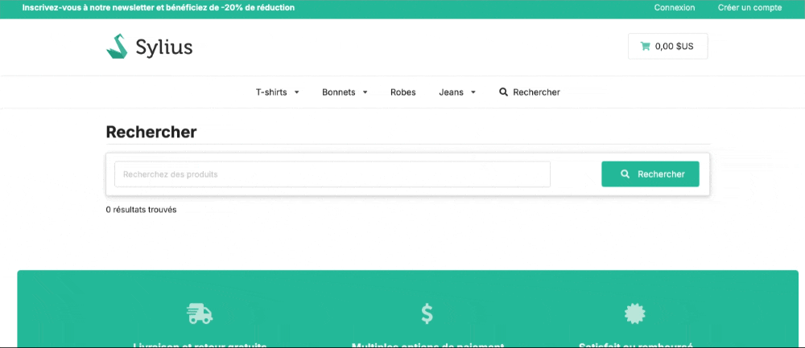

<p align="center">
    <a href="https://www.acseo.fr" target="_blank">
        ACSEO
    </a>
</p>

<h1 align="center">
Sylius Typesense
<br />
    <a href="https://packagist.org/packages/acseo/sylius-typesense" title="License" target="_blank">
        
    </a>
    <a href="https://packagist.org/packages/acseo/sylius-typesense" title="Version" target="_blank">
        
    </a>
</h1>


<p></p>

## Introduction
**Sylius Typesense** is a plugin for integrating [Typesense](https://typesense.org/), a fast and powerful search engine, with [Sylius](https://sylius.com/), an open-source e-commerce platform. This plugin boosts your Sylius store’s search capabilities by leveraging Typesense’s advanced search features, providing fast, relevant search results.

## Features
- Seamless integration with Sylius.
- Automatic indexing of product data.
- Support for a variety of field types (e.g., primary, collection, object).
- Easy-to-use console commands for creating and importing collections.

## Installation
Follow these steps to integrate **Sylius Typesense** into your project:

### Step 1: Install the Package
Install the **Sylius Typesense** plugin using Composer. Run the following command in your terminal:
```bash
$ composer require acseo/sylius-typesense
```

### Step 2: Register the Plugin
Once the package is installed, you need to register the plugin in your Symfony application. Open the config/bundles.php file and add the following lines:
```php
return [
    ACSEO\TypesenseBundle\ACSEOTypesenseBundle::class => ['all' => true],
    ACSEO\SyliusTypesense\ACSEOSyliusTypesense::class => ['all' => true],
];
```

### Step 3: Import Required Configuration
Next, import the configuration by adding the service definitions to your config/packages/_sylius.yaml file:
```yaml
# config/packages/_sylius.yaml
imports:
    - { resource: "@ACSEOSyliusTypesense/Resources/config/services.yaml" }
```

### Step 4: Import Routing Configuration
To make the routes available, you need to import the routing configuration. Add the following lines to your config/routes.yaml file:

```yaml
# config/routes.yaml
sylius_typesense:
    resource: "@ACSEOSyliusTypesense/Resources/config/routes.yaml"
```

### Step 5: Set Up Typesense with Docker
To run Typesense locally, you can use Docker. Add the following service definition to your docker-compose.yaml file:
Add to docker-compose.yaml
```yaml
services:
    typesense:
        image: typesense/typesense:27.1
        restart: on-failure
        ports:
            - "8108:8108"
        volumes:
            - ./typesense-data:/data
        command: '--data-dir /data --api-key=xyz --enable-cors'
```
Start the services by running:
```bash
$ make down up
```

## Configuration
### Step 1: Configure Environment Variables
Add the following configuration to your .env file to set up the Typesense URL and API key:
```bash
TYPESENSE_URL=http://localhost:8108
TYPESENSE_KEY=123
PRODUCT_SEARCH_LIMIT=9
```

### Step 2: Plugin Configuration
Next, add the following configuration to your **config/packages/acseo_typesense.yaml** file:
```yaml
acseo_typesense:
    typesense:
        url: 'http://localhost:8108'
        key: 'xyz'
        collection_prefix: 'test_'
    collections:
        products:
            entity: 'App\Entity\Product\Product'
            fields:
                id:
                    name: id
                    type: primary
                sortable_id:
                    entity_attribute: id
                    name: sortable_id
                    type: int32
                code:
                    name: code
                    type: string
                    infix: true
                translations:
                    name: translations
                    type: collection
                    infix: true
                taxons:
                    name: taxons
                    type: collection
                    infix: true
                embedding:
                    name: embedding
                    type: float[]
                    embed:
                        from:
                            - translations
                            - taxons
                            - code
                        model_config:
                            model_name: ts/e5-small
            
            default_sorting_field: sortable_id
            symbols_to_index: [ '+' ]
```
You can use various field types supported by Typesense such as string, int32, float, and others. Types such as primary, collection, and object are also supported.

### Step 3: Modify the ProductTranslation Entity
To ensure compatibility with the Typesense plugin, you need to extend the ProductTranslation entity from **ACSEO\SyliusTypesense\Entity\Product\ProductTranslation**. Modify the ProductTranslation class in your App\Entity\Product namespace like so:
```php
<?php

declare(strict_types=1);

namespace App\Entity\Product;

use Doctrine\ORM\Mapping as ORM;
use ACSEO\SyliusTypesense\Entity\Product\ProductTranslation as BaseProductTranslation;

/**
 * @ORM\Entity
 * @ORM\Table(name="sylius_product_translation")
 */
#[ORM\Entity]
#[ORM\Table(name: 'sylius_product_translation')]
class ProductTranslation extends BaseProductTranslation
{
}
```
This will allow Sylius Typesense to properly work with your custom product translations.


### Step 4: Add Plugin Templates
Copy the plugin templates into your project's template directory. Run the following command:
```bash
cp -R vendor/acseo/sylius-typesense/src/Resources/views/bundles/ templates/bundles/
```


## Usage
### Create Index and Populate Data
This plugin provides useful commands to create and index your data.
#### Create collection structure
To create the collection structure, run the following command:
```bash
php bin/console typesense:create
```
#### Import collections with Doctrine entities
To import collections with your Doctrine entities, use the following command:
```bash
php bin/console typesense:import
```
